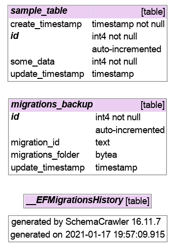

# skeleton-netcore-ef-code-first

<!-- TOC -->
* [description](#description)
* [quickstart](#quickstart)
* [manage migrations](#manage-migrations)
* [create database diagram](#create-database-diagram)
* [how this project was built](#how-this-project-was-built)
<!-- TOCEND -->

## description

example of netcore console app using efcore + psql with support for migrations backup.

## quickstart

- tune [appname][5] used to locate `~/.config/appname/config.json` pathfilename

- create a db on target

- create first migration

```sh
git clone https://github.com/devel0/skeleton-netcore-ef-code-first
cd skeleton-netcore-ef-code-first
dotnet run
```

- tune created `~/.config/skeleton-netcore-ef-core-first/config.json` file

- execute first migration ( this will create or update tables )

```sh
./add-migr.sh
```

- execute example

```sh
$ dotnet run -c Release
=== ENT NAME [skeleton_netcore_ef_code_first.MigrationsBackup]
=== ENT NAME [skeleton_netcore_ef_code_first.SampleTable]
warn: Microsoft.EntityFrameworkCore.Model.Validation[10400]
      Sensitive data logging is enabled. Log entries and exception messages may include sensitive application data; this mode should only be enabled during development.
info: Microsoft.EntityFrameworkCore.Infrastructure[10403]
      Entity Framework Core 5.0.2 initialized 'MyDbContext' using provider 'Npgsql.EntityFrameworkCore.PostgreSQL' with options: SensitiveDataLoggingEnabled 
info: Microsoft.EntityFrameworkCore.Database.Command[20101]
      Executed DbCommand (3ms) [Parameters=[], CommandType='Text', CommandTimeout='30']
      SELECT s.id, s.create_timestamp, s.some_data, s.update_timestamp
      FROM sample_table AS s
      ORDER BY s.create_timestamp DESC
      LIMIT 1
last created record @[17/01/2021 20:15:04] some_data=1
info: Microsoft.EntityFrameworkCore.Database.Command[20101]
      Executed DbCommand (8ms) [Parameters=[@p0='2021-01-17T19:19:56.3664328Z' (DbType = DateTime), @p1='2', @p2=NULL (DbType = DateTime)], CommandType='Text', CommandTimeout='30']
      INSERT INTO sample_table (create_timestamp, some_data, update_timestamp)
      VALUES (@p0, @p1, @p2)
      RETURNING id;
new record added : {
  "create_timestamp": "2021-01-17T19:19:56.3664328Z",
  "some_data": 2,
  "id": 10,
  "update_timestamp": null
}
```

notes:
- create timestamp recorded from code using [utc][1] so that db doesn't need to store timezone; it will recognized during [read][2]
- update_timestamp will automatically updated at first record change through a [trigger][3]

## manage migrations

- `add-migr.sh` : create new migration from current code toward db
- `backup-migr.sh` : automatically invoked by add-migr
- `restore-migr.sh` : if lost `Migrations` folder a restore from autoarchived db version can be done

notes:
- do not add `Migrations` to git because other deveopers may work on other stage fo migrations on other database hosts
- [references][4]

[1]: https://github.com/devel0/skeleton-netcore-ef-code-first/blob/a6a0bbd6df764d48dd1a400dd2067448291709d2/Program.cs#L35
[2]: https://github.com/devel0/skeleton-netcore-ef-code-first/blob/a6a0bbd6df764d48dd1a400dd2067448291709d2/db/types/SampleTable.cs#L18
[3]: https://github.com/devel0/skeleton-netcore-ef-code-first/blob/a6a0bbd6df764d48dd1a400dd2067448291709d2/db/MyDbContext.cs#L174
[4]: https://github.com/devel0/skeleton-netcore-ef-react-ts/blob/033a325fbc21b2e9dfd65307f88b40c7f1bab2d4/README.md#update-database-and-diagram
[5]: https://github.com/devel0/skeleton-netcore-ef-code-first/blob/a6a0bbd6df764d48dd1a400dd2067448291709d2/Global.cs#L40

## create database diagram

- tune dbhost and dbname in the script
- set auth in `~/.pgpass` like so

```
10.10.5.2:*:*:postgres:secret-pass
```

that mean to use given `secret-pass` for access when user is `postgres` for any database,port when host is `10.10.5.2`

general form is

```
hostname:port:database:username:password
```

- run the tool

```sh
./gen-db-dia.sh
```

result:


## how this project was built

```sh
dotnet new console -n skeleton-netcore-ef-code-first
cd skeleton-netcore-ef-code-first
dotnet add package Microsoft.EntityFrameworkCore.Design --version 5.0.2
dotnet add package Npgsql.EntityFrameworkCore.PostgreSQL --version 5.0.1
dotnet add package Microsoft.Extensions.Logging.Console --version 5.0.0
dotnet add package Microsoft.Extensions.Options --version 5.0.0
dotnet add package Newtonsoft.Json --version 12.0.3
dotnet add package netcore-util --version 1.9.1
dotnet add package Mono.Posix.NETStandard --version 5.20.1-preview
```