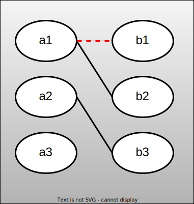

# skeleton-netcore-ef-code-first

- [description](#description)
- [quickstart](#quickstart)
- [Generated db structure](#generated-db-structure)
- [One (B) to One (A)](#one-b-to-one-a)
- [One (D) to Many (C)](#one-d-to-many-c)
- [Many (E) to Many (F)](#many-e-to-many-f)
- [Test futher configs](#test-futher-configs)
- [how this project was built](#how-this-project-was-built)

## description

Shows how to create a code-first local db using sqlite but the same approach can applied using other backends.

## quickstart

```sh
git clone https://github.com/devel0/skeleton-netcore-ef-code-first
cd skeleton-netcore-ef-code-first
git checkout one-to-many
dotnet tool restore
# dotnet ef database update # migrations auto-applied by code
dotnet run
```

## Generated db structure


## One (B) to One (A)

```csharp
public class TableA_One
{
    [Key]
    public int Id { get; set; }    
    public int BObjectId { get; set; } // required foreign key (see note)
    public TableB_One BObject { get; set; } = null!; // one ( required )
    public string? Data { get; set; }
}

public class TableB_One
{
    [Key]
    public int Id { get; set; }

    public virtual TableA_One? AObject { get; set; } // one ( optional )
    public string? Data { get; set; }
}
```



note:
- `ObjectId` specified otherwise follow compile error generates:

*The dependent side could not be determined for the one-to-one relationship between 'TableA_One.BObject' and 'TableB_One.AObject'. To identify the dependent side of the relationship, configure the foreign key property. If these navigations should not be part of the same relationship, configure them independently via separate method chains in 'OnModelCreating'. See http://go.microsoft.com/fwlink/?LinkId=724062 for more details.*    

```csharp
var b1 = new TableB_One { Data = "b1" };
var b2 = new TableB_One { Data = "b2" };

var a1 = new TableA_One { Data = "a1", BObject = b1 }; // NOTE: THIS WILL GET SKIPPED
var a2 = new TableA_One { Data = "a2", BObject = b1 }; // CAUSE THIS FURTHER ASSIGNMENT ( relation is one-to-one )
var a3 = new TableA_One { Data = "a3", BObject = b2 };

dbContext.ARecords.AddRange(new[] { a1, a2, a3 }); // NOTE: a1 "OVERWRITTEN" BY a2
```

**from A to B**

```csharp
var q = dbContext.ARecords
  .Include(x => x.BObject)
  .Select(x => new { a = new { x.Id, x.Data }, b = new { x.BObject.Id, x.BObject.Data } })
  .ToList();
```

```log
FROM A TO B
===========
(local) DB> info: 11/18/2023 10:19:57.280 RelationalEventId.CommandExecuted[20101] (Microsoft.EntityFrameworkCore.Database.Command) 
      Executed DbCommand (0ms) [Parameters=[], CommandType='Text', CommandTimeout='30']
      SELECT "a"."Id", "a"."Data", "b"."Id", "b"."Data"
      FROM "ARecords" AS "a"
      INNER JOIN "BRecords" AS "b" ON "a"."BObjectId" = "b"."Id"
{
  "a": {
    "Id": 1,
    "Data": "a2"
  },
  "b": {
    "Id": 1,
    "Data": "b1"
  }
}
{
  "a": {
    "Id": 2,
    "Data": "a3"
  },
  "b": {
    "Id": 2,
    "Data": "b2"
  }
}
```

**from B to A**

```csharp
var q = dbContext.BRecords
  .Include(x => x.AObject)
  .Select(x => new { b = new { x.Id, x.Data }, a = new { x.AObject.Id, x.AObject.Data } })
  .ToList();
```

```log
FROM B TO A
===========
(local) DB> info: 11/18/2023 10:19:57.311 RelationalEventId.CommandExecuted[20101] (Microsoft.EntityFrameworkCore.Database.Command) 
      Executed DbCommand (0ms) [Parameters=[], CommandType='Text', CommandTimeout='30']
      SELECT "b"."Id", "b"."Data", "a"."Id", "a"."Data"
      FROM "BRecords" AS "b"
      LEFT JOIN "ARecords" AS "a" ON "b"."Id" = "a"."BObjectId"
{
  "b": {
    "Id": 1,
    "Data": "b1"
  },
  "a": {
    "Id": 1,
    "Data": "a2"
  }
}
{
  "b": {
    "Id": 2,
    "Data": "b2"
  },
  "a": {
    "Id": 2,
    "Data": "a3"
  }
}
```

## One (D) to Many (C)

```csharp
public class TableC_Many
{
    [Key]
    public int Id { get; set; }    
    public TableD_One? DObject { get; set; } // one
    public string? Data { get; set; }
}

public class TableD_One
{
    [Key]
    public int Id { get; set; }
    public ICollection<TableC_Many> CObjects { get; set; } // many
    public string? Data { get; set; }
}
```


```csharp
var d1 = new TableD_One { Data = "d1" };
var d2 = new TableD_One { Data = "d2" };

var c1 = new TableC_Many { Data = "c1", DObject = d1 };
var c2 = new TableC_Many { Data = "c2", DObject = d1 };
var c3 = new TableC_Many { Data = "c3", DObject = d2 };

dbContext.CRecords.AddRange(new[] { c1, c2, c3 });
```

**from C to D**

```csharp
 var q = dbContext.CRecords
  .Include(x => x.DObject)
  .Select(x => new { C = new { x.Id, x.Data }, D = new { x.DObject.Id, x.DObject.Data } })
  .ToList();
```

```log
FROM C TO D
===========
(local) DB> info: 11/18/2023 10:35:59.151 RelationalEventId.CommandExecuted[20101] (Microsoft.EntityFrameworkCore.Database.Command) 
      Executed DbCommand (0ms) [Parameters=[], CommandType='Text', CommandTimeout='30']
      SELECT "c"."Id", "c"."Data", "d"."Id", "d"."Data"
      FROM "CRecords" AS "c"
      LEFT JOIN "DRecords" AS "d" ON "c"."DObjectId" = "d"."Id"
{
  "C": {
    "Id": 1,
    "Data": "c1"
  },
  "D": {
    "Id": 1,
    "Data": "d1"
  }
}
{
  "C": {
    "Id": 2,
    "Data": "c2"
  },
  "D": {
    "Id": 1,
    "Data": "d1"
  }
}
{
  "C": {
    "Id": 3,
    "Data": "c3"
  },
  "D": {
    "Id": 2,
    "Data": "d2"
  }
}
```

**from D to C**

```csharp
var q = dbContext.DRecords
  .Include(x => x.CObjects)
  .Select(x => new { D = new { x.Id, x.Data }, C = x.CObjects.Select(y => new { y.Id, y.Data }) })
  .ToList();
```

```log
FROM D TO C
===========
(local) DB> info: 11/18/2023 10:35:59.177 RelationalEventId.CommandExecuted[20101] (Microsoft.EntityFrameworkCore.Database.Command) 
      Executed DbCommand (0ms) [Parameters=[], CommandType='Text', CommandTimeout='30']
      SELECT "d"."Id", "d"."Data", "c"."Id", "c"."Data"
      FROM "DRecords" AS "d"
      LEFT JOIN "CRecords" AS "c" ON "d"."Id" = "c"."DObjectId"
      ORDER BY "d"."Id"
{
  "D": {
    "Id": 1,
    "Data": "d1"
  },
  "C": [
    {
      "Id": 1,
      "Data": "c1"
    },
    {
      "Id": 2,
      "Data": "c2"
    }
  ]
}
{
  "D": {
    "Id": 2,
    "Data": "d2"
  },
  "C": [
    {
      "Id": 3,
      "Data": "c3"
    }
  ]
}
```

## Many (E) to Many (F)

```csharp
public class TableE_Many
{
    [Key]
    public int Id { get; set; }    
    public List<TableF_Many>? FObjects { get; set; } = new(); // many
    public string? Data { get; set; }
}

public class TableF_Many
{
    [Key]
    public int Id { get; set; }
    public List<TableE_Many> EObjects { get; set; } = new(); // many
    public string? Data { get; set; }
} 
```


```csharp
var e1 = new TableE_Many { Data = "e1" };
var e2 = new TableE_Many { Data = "e2" };
var e3 = new TableE_Many { Data = "e3" };

var f1 = new TableF_Many { Data = "f1" };
var f2 = new TableF_Many { Data = "f2" };
var f3 = new TableF_Many { Data = "f3" };

e1.FObjects.Add(f1);
e1.FObjects.Add(f2);

e2.FObjects.Add(f3);

f3.EObjects.Add(e3);
f3.EObjects.Add(e1);

dbContext.ERecords.AddRange(new[] { e1, e2, e3 });
```

**from E to F**

```csharp
var q = dbContext.ERecords
  .Include(x => x.FObjects)
  .Select(x => new
  {
      E = new { x.Id, x.Data },
      F = x.FObjects.Select(y => new { y.Id, y.Data }),
  })
  .ToList();
```

```log
FROM E TO F
===========
(local) DB> info: 11/18/2023 10:35:59.244 RelationalEventId.CommandExecuted[20101] (Microsoft.EntityFrameworkCore.Database.Command) 
      Executed DbCommand (0ms) [Parameters=[], CommandType='Text', CommandTimeout='30']
      SELECT "e"."Id", "e"."Data", "t0"."Id", "t0"."Data", "t0"."EObjectsId", "t0"."FObjectsId"
      FROM "ERecords" AS "e"
      LEFT JOIN (
          SELECT "f"."Id", "f"."Data", "t"."EObjectsId", "t"."FObjectsId"
          FROM "TableE_ManyTableF_Many" AS "t"
          INNER JOIN "FRecords" AS "f" ON "t"."FObjectsId" = "f"."Id"
      ) AS "t0" ON "e"."Id" = "t0"."EObjectsId"
      ORDER BY "e"."Id", "t0"."EObjectsId", "t0"."FObjectsId"
{
  "E": {
    "Id": 1,
    "Data": "e1"
  },
  "F": [
    {
      "Id": 1,
      "Data": "f1"
    },
    {
      "Id": 2,
      "Data": "f2"
    },
    {
      "Id": 3,
      "Data": "f3"
    }
  ]
}
{
  "E": {
    "Id": 2,
    "Data": "e2"
  },
  "F": [
    {
      "Id": 3,
      "Data": "f3"
    }
  ]
}
{
  "E": {
    "Id": 3,
    "Data": "e3"
  },
  "F": [
    {
      "Id": 3,
      "Data": "f3"
    }
  ]
}
```

**from F to E**

```csharp
var q = dbContext.FRecords
  .Include(x => x.EObjects)
  .Select(x => new
  {
      F = new { x.Id, x.Data },
      E = x.EObjects.Select(y => new { y.Id, y.Data }),
  })
  .ToList();
```

```log
FROM F TO E
===========
(local) DB> info: 11/18/2023 10:35:59.251 RelationalEventId.CommandExecuted[20101] (Microsoft.EntityFrameworkCore.Database.Command) 
      Executed DbCommand (0ms) [Parameters=[], CommandType='Text', CommandTimeout='30']
      SELECT "f"."Id", "f"."Data", "t0"."Id", "t0"."Data", "t0"."EObjectsId", "t0"."FObjectsId"
      FROM "FRecords" AS "f"
      LEFT JOIN (
          SELECT "e"."Id", "e"."Data", "t"."EObjectsId", "t"."FObjectsId"
          FROM "TableE_ManyTableF_Many" AS "t"
          INNER JOIN "ERecords" AS "e" ON "t"."EObjectsId" = "e"."Id"
      ) AS "t0" ON "f"."Id" = "t0"."FObjectsId"
      ORDER BY "f"."Id", "t0"."EObjectsId", "t0"."FObjectsId"
{
  "F": {
    "Id": 1,
    "Data": "f1"
  },
  "E": [
    {
      "Id": 1,
      "Data": "e1"
    }
  ]
}
{
  "F": {
    "Id": 2,
    "Data": "f2"
  },
  "E": [
    {
      "Id": 1,
      "Data": "e1"
    }
  ]
}
{
  "F": {
    "Id": 3,
    "Data": "f3"
  },
  "E": [
    {
      "Id": 1,
      "Data": "e1"
    },
    {
      "Id": 2,
      "Data": "e2"
    },
    {
      "Id": 3,
      "Data": "e3"
    }
  ]
}
```

## Test futher configs

to redo other tests after mapping changes:

```sh
rm -fr bin obj Migrations
dotnet ef migrations add init
dotnet run
```

## how this project was built

```sh
dotnet new console -n skeleton-netcore-ef-code-first -f net7.0 --langVersion 11

cd skeleton-netcore-ef-code-first
dotnet new tool-manifest
dotnet tool install dotnet-ef
dotnet add package Microsoft.EntityFrameworkCore.Design --version 7.0.5
dotnet add package Microsoft.EntityFrameworkCore.Sqlite --version 7.0.5
dotnet ef migrations add init
```